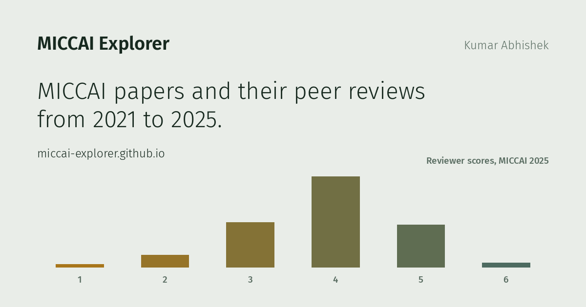

# MICCAI Explorer

### → **[miccai-explorer.github.io](https://miccai-explorer.github.io/)**



Five years of MICCAI papers and their published peer reviews, in one interactive site.
No install, no account, nothing to download.

[](https://github.com/astral-sh/ruff)
[](https://github.com/astral-sh/uv)
[](pyproject.toml)
[](LICENSE)
[](https://github.com/miccai-explorer/miccai-explorer.github.io/actions/workflows/deploy.yml)
[](https://github.com/miccai-explorer/miccai-explorer.github.io/actions/workflows/deploy.yml)

[](https://miccai-explorer.github.io/)
[](https://miccai-explorer.github.io/papers.html)
[](https://miccai-explorer.github.io/)
[](https://miccai-explorer.github.io/orals.html)
[](https://miccai-explorer.github.io/)

An interactive explorer for five years of MICCAI papers (2021 to 2025), built on the
conference's own open-access proceedings **and its published peer reviews**.

MICCAI is one of the few major conferences that publishes the full review record for
every accepted paper: reviewer scores, written reviews, rebuttals, and meta-reviews.
It separately publishes a program book naming which papers were given a talk. Nobody
had joined those two sources before. This project does, which makes it possible to ask
questions that were previously unanswerable from public data.

## What is in it

| | |
|---|---|
| Papers | 3,717 (531 in 2021, 573 in 2022, 730 in 2023, 856 in 2024, and 1,027 in 2025) |
| Peer reviews | 11,359, with scores, confidence ratings, and full text |
| Meta-reviews | 7,642 |
| Unique authors | 12,307 |
| Oral and spotlight talks | 377, matched to their papers from the official program PDFs |
| Papers releasing code | 2,365 (63.6%) |

## The pages

- **Overview and Trends.** A semantic map of all 3,717 papers, positioned by a
  SPECTER2 embedding of title and abstract, and coloured by year or by topic cluster.
  Click any point to open the paper. Below it: submissions, acceptance rate, early
  accepts, code release, review scores, and how subject areas have risen and fallen.
- **Orals & Spotlights.** What separates a talk from a poster. Review scores by tier
  with effect sizes, early acceptance (which turns out to be a genuine confounder and
  is controlled for), reviewer confidence, and which subject areas get the slots.
- **All Papers.** Every one of the 3,717 papers in a single list, searchable by
  title, author, or subject area, and filterable by year, presentation type,
  subject area, code release, and early acceptance. Click a row for its authors,
  reviewer scores, and links; click the title to open the paper itself. Sorting by
  score uses each paper's share of its own year's scale, because the scale changed
  twice. Any filtered view can be shared as a link or exported as CSV.
- **One page per year.** Score distributions, the controversy of a paper (the spread
  between its reviewers), rebuttal verdict flows, co-authorship networks, subject-area
  breakdowns, title patterns, and the top-scoring papers of that year.

## Some things it shows

- Orals outscore poster-only papers in every year studied, but the gap has narrowed
  sharply: it was large in 2021 to 2024 and is only small in 2025.
- Early-accepted papers are far more likely to get a talk (49% to 85% of orals were
  early accepts, against 28% to 40% of posters). This is a confounder rather than a
  footnote, so the score gap is also reported *within* each stratum. It survives, and
  it narrows.
- Reviewer confidence does not separate the tiers in any year. Whatever earns a paper
  a talk, it is not how sure its reviewers were.
- Surgical and interventional topics are consistently over-represented on the stage.

## Running it yourself

Everything needed to rebuild the website is committed, so you do not need to scrape
anything or own a GPU:

```bash
git clone https://github.com/miccai-explorer/miccai-explorer.github.io
cd miccai-explorer.github.io
pip install -r requirements.txt

python analysis/build_charts.py   # all Plotly charts -> website/charts/
python analysis/build_site.py     # all HTML pages    -> website/

python -m http.server 8000 --directory website
# open http://localhost:8000/
```

To rebuild the data from scratch (scraping, embeddings, and the oral program
extraction) see [CONTRIBUTING.md](CONTRIBUTING.md), which walks through every stage
and says which ones need a GPU.

## How it works

```
papers.miccai.org  ->  scraper/scrape.py      ->  data/raw/miccai_YYYY.json
                       analysis/normalize.py  ->  data/processed/miccai_all.json
                       analysis/embed.py      ->  embeddings, 2D projections, clusters

program PDFs     ->  analysis/extract_orals.py  ->  data/raw/orals_YYYY.json
                       analysis/match_orals.py    ->  data/processed/orals.json

                       analysis/build_charts.py   ->  website/charts/*.html
                       analysis/build_site.py     ->  website/*.html
```

Each stage is independently re-runnable and writes files the next stage reads, so you
can start from wherever the committed data already gets you.

## Documentation

| File | What it covers |
|---|---|
| [CONTRIBUTING.md](CONTRIBUTING.md) | Setup, reproducing the analysis, and how to contribute |
| [DESIGN.md](DESIGN.md) | The visual system every page and chart follows |
| [REPRODUCIBILITY.md](REPRODUCIBILITY.md) | What is committed, what must be regenerated, and the known gaps |
| [CLAUDE.md](CLAUDE.md) | Full technical reference: data schema, per-year HTML parsing, and pipeline internals |

## Data, provenance, and limits

Paper metadata and peer reviews are collected from
[papers.miccai.org](https://papers.miccai.org) and its predecessor sites, which publish
them openly. Presentation tiers are read from the official MICCAI program books.
Nothing here is private or leaked; all of it is material MICCAI chose to publish.

Two limits are worth stating plainly, because they bound what any of these numbers can
support:

1. **Only accepted papers are visible.** Rejected submissions are not published, so
   every comparison here is between accepted papers. Nothing in this repository can
   tell you what separates an accepted paper from a rejected one.
2. **Selection is not random.** Program chairs choose talks deliberately, for topical
   balance and session themes as well as merit, so none of this shows that a talk
   *causes* anything.

This project is not affiliated with, endorsed by, or reviewed by the MICCAI Society.
Any errors are the maintainers' own. If you spot one, please open an issue.

## License

Code: [MIT](LICENSE).

Data: the underlying papers, reviews, and program books remain the property of their
respective authors, publishers, and the MICCAI Society. The derived JSON in `data/` is
redistributed here to make the analysis reproducible, not relicensed.

## Citing this

If you use this data or these figures, please cite the repository and, separately, the
original papers you draw on.
